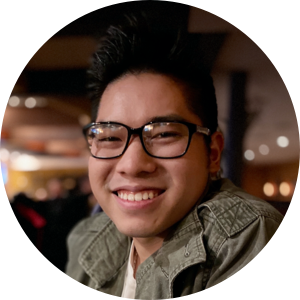

	 

<h1 align="center">Kenny Ho</h1>
<h3 align="center"> iOS Developer</h3>

 
	
	
	
	
	

Hey there, I’m Kenny, a recent graduate at Temple University. I am currently pursuing a career in iOS mobile development. I am a self-taught developer who have been programming for the past 2 years. I specialize in front-end development. Something interesting about me is that in college in pursued a finance degree but grew to love software development during my junior year. I'm also a member of PhillyCocoaHeads and Philadelphia GDG. Check out some of my work below and feel free to reach out to me at any time!	

<h1 align="center">App Portfolio</h1>

	

<h3 align="center">CookAList</h3>

	

	Easy and convenient way to store your favorite recipes. Share these with your friends!

	<code>XCode</code>
	<code>Swift</code>
	<code>UIKit</code>

	<code>Cocoapods</code>
	<code>Lottie</code>
	<code>UserDefaults</code>

	
	
	

<h1 align="center">Open Source Projects</h1>

	

<h3 align="center">CookAList</h3>

